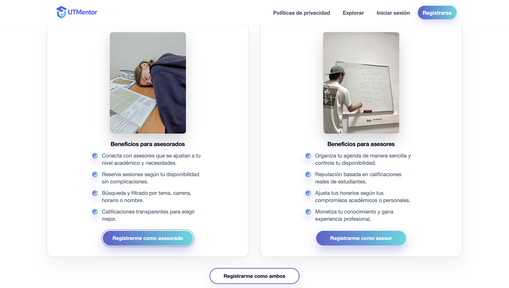
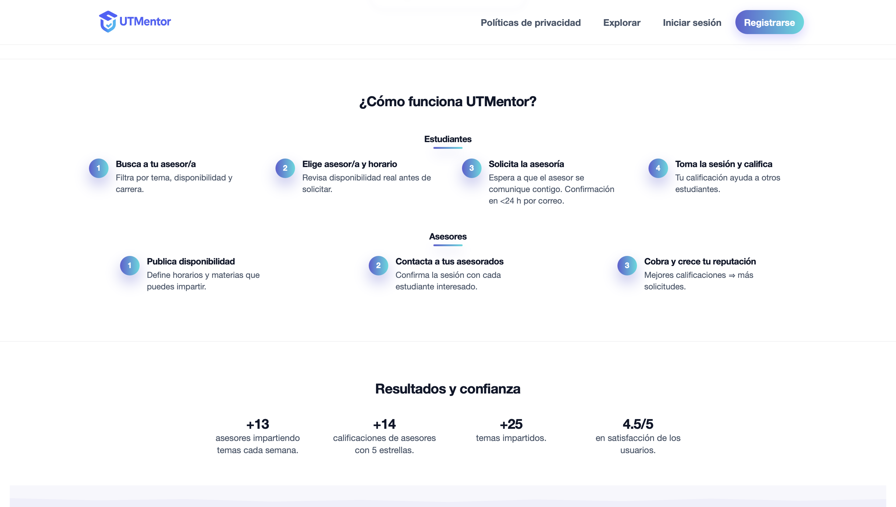
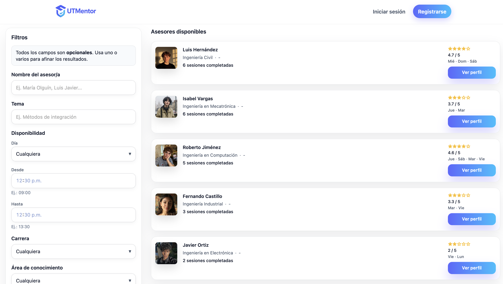
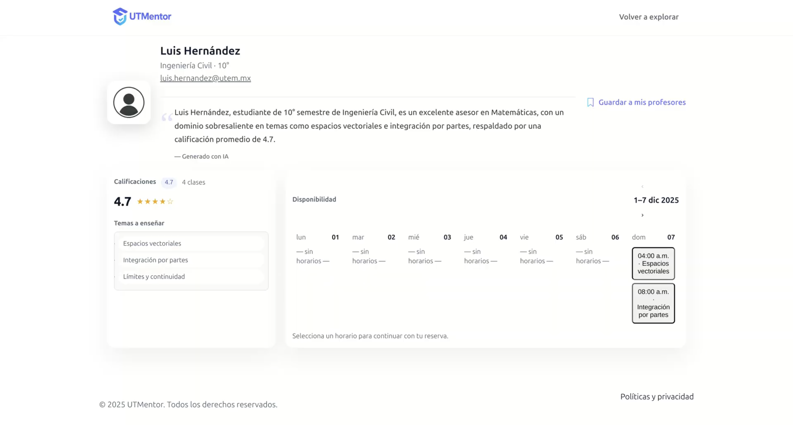
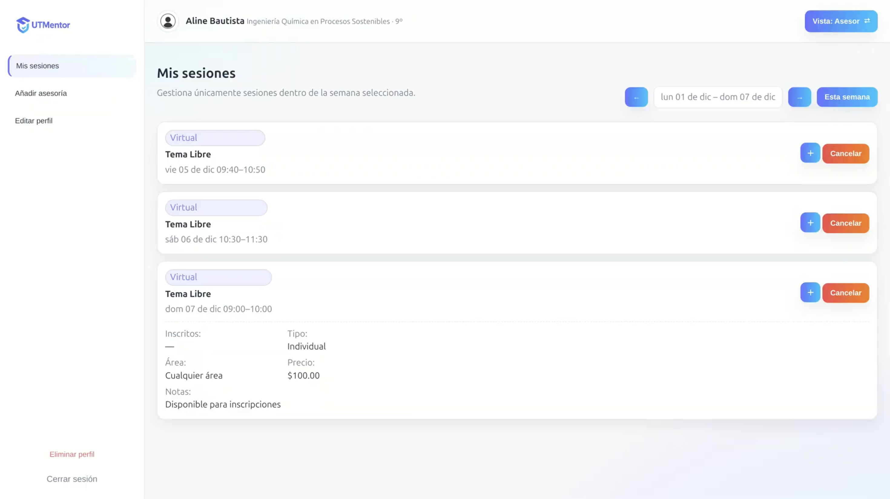

# UTMentor

Plataforma web para la gestión y reserva de asesorías académicas, desarrollada bajo una arquitectura cliente-servidor utilizando Node.js, MySQL, Docker y servicios externos como Stripe, MinIO y Gemini API.

## Descripción

UTMentor es una plataforma web que permite:
- **Asesores**: Publicar disponibilidades, ofrecer sesiones individuales o grupales (presenciales/virtuales) y recibir pagos
- **Asesorados**: Buscar asesores por tema/área, reservar sesiones, calificar y guardar favoritos
- Gestión de pagos integrada con Stripe
- Sistema de calificaciones y reseñas
- Recuperación de contraseña por email
- Almacenamiento de archivos con MinIO
- Asistente con IA integrado

## Capturas de Pantalla

### Página Principal

<p align="center">
  
</p>

La página principal permite acceder a las funcionalidades principales de la plataforma y explorar las asesorías disponibles.

<p align="center">
  
</p>

Tambien muestra la información de presentación para el entendimiento de la aplicación web.

<p align="center">
  
</p>

---

### Exploración de Asesores

<p align="center">
  
</p>

Los estudiantes pueden buscar asesores por área de conocimiento, tema o perfil, facilitando la localización de especialistas en distintas materias.

---

### Perfil de Asesor

<p align="center">
  
</p>

Cada asesor cuenta con un perfil que incluye información académica, áreas de experiencia, disponibilidad y valoraciones de otros usuarios.

---

### Vista del Asesor

<p align="center">
  
</p>

Los asesores pueden administrar sus sesiones, horarios disponibles y solicitudes recibidas desde una interfaz dedicada.

## Arquitectura

```
┌─────────────┐     ┌─────────────┐     ┌─────────────┐
│   Frontend  │────▶  Nginx       ────▶│   API       │
│   (HTML/JS) │     │   :8180     │     │   :3000     │
└─────────────┘     └─────────────┘     └─────────────┘
                                               │
                    ┌──────────────────────────┼──────────────────────────┐
                    │                          │                          │
                    ▼                          ▼                          ▼
             ┌─────────────┐           ┌─────────────┐           ┌─────────────┐
             │   MySQL     │           │   MinIO     │           │  phpMyAdmin │
             │   :3316     │           │ :9000/:9001 │           │   :8080     │
             └─────────────┘           └─────────────┘           └─────────────┘
```

## Tecnologías

### Backend (API)
- **Node.js** con Express.js
- **MySQL 8.4** - Base de datos relacional
- **JWT** - Autenticación con tokens
- **bcryptjs** - Encriptación de contraseñas
- **Stripe** - Procesamiento de pagos
- **Nodemailer** - Envío de emails
- **MinIO** - Almacenamiento S3-compatible
- **Swagger** - Documentación de API

### Frontend
- HTML5, CSS3, JavaScript (Vanilla)
- Servido por Nginx

### Infraestructura
- **Docker Compose** - Orquestación de servicios
- **Nginx** - Servidor web y proxy reverso
- **phpMyAdmin** - Administración de base de datos

## Estructura del Proyecto

```
mvc/
├── api/                      # Backend Node.js/Express
│   ├── config/               # Configuración (DB, MinIO)
│   ├── controllers/          # Lógica de negocio
│   ├── middleware/           # Middlewares (auth, etc.)
│   ├── models/               # Modelos MySQL
│   ├── routes/               # Definición de endpoints
│   ├── scripts/              # Scripts utilitarios
│   ├── utils/                # Utilidades
│   └── server.js             # Punto de entrada
├── mysql/
│   └── init.sql              # Script de inicialización BD
├── UTMentor/                 # Frontend
│   ├── css/
│   ├── html/
│   ├── js/
│   └── imagenes/
├── docker-compose.yml
├── nginx.conf
└── .env                      # Variables de entorno (crear)
```

## Instalación y Ejecución

### Requisitos
- Docker y Docker Compose
- Node.js 18+ (para desarrollo local)

### 1. Clonar y configurar

```bash
cd mvc
```

### 2. Crear archivo `.env`

```env
# MySQL
MYSQL_ROOT_PASSWORD=tu_password_seguro
MYSQL_DATABASE=utmentor

# API
PORT=3000
JWT_SECRET=tu_jwt_secret_muy_seguro
JWT_EXPIRES_IN=7d

# Stripe
STRIPE_SECRET_KEY=sk_test_xxxx

# MinIO
MINIO_ROOT_USER=admin
MINIO_ROOT_PASSWORD=tu_minio_password
MINIO_ENDPOINT=minio
MINIO_PORT=9000

# Email (Nodemailer)
EMAIL_HOST=smtp.gmail.com
EMAIL_PORT=587
EMAIL_USER=tu_email@gmail.com
EMAIL_PASS=tu_app_password
```

### 3. Ejecutar con Docker Compose

```bash
docker compose up -d
```

### 4. Verificar servicios

| Servicio      | URL                          |
|---------------|------------------------------|
| Frontend      | http://localhost:8180        |
| API           | http://localhost:3000        |
| Swagger Docs  | http://localhost:3000/api-docs |
| phpMyAdmin    | http://localhost:8080        |
| MinIO Console | http://localhost:9001        |

## Endpoints de la API

### Autenticación
- `POST /api/auth/login` - Iniciar sesión
- `POST /api/auth/register` - Registrar usuario

### Usuarios
- `GET /api/usuarios` - Listar usuarios
- `GET /api/usuarios/asesores` - Listar asesores (ordenados por calificación)
- `GET /api/usuarios/:id` - Obtener usuario por ID

### Asesorías
- `GET /api/asesorias` - Listar asesorías disponibles
- `POST /api/asesorias` - Crear disponibilidad (asesor)

### Inscripciones
- `POST /api/inscripciones` - Inscribirse a una sesión
- `GET /api/inscripciones/:id` - Ver inscripciones

### Favoritos
- `GET /api/favoritos/:userId` - Obtener favoritos
- `POST /api/favoritos` - Agregar favorito
- `DELETE /api/favoritos/:id` - Eliminar favorito

### Pagos
- `POST /api/pagos/create-checkout` - Crear sesión de pago Stripe

### Email
- `POST /api/email/recovery` - Enviar email de recuperación

### IA
- `POST /api/ia` - Consultar asistente IA

> Documentación completa en Swagger: http://localhost:3000/api-docs

## Modelo de Datos

### Tablas Principales
- `usuarios` - Información de usuarios (asesores y asesorados)
- `roles` - Roles del sistema (Asesor, Asesorado)
- `carreras` - Catálogo de carreras universitarias
- `areas_conocimiento` - Áreas de estudio (Matemáticas, Programación, etc.)
- `temas` - Temas específicos por área
- `asesores_temas` - Relación muchos-a-muchos asesores-temas
- `disponibilidades` - Horarios disponibles de asesores
- `inscripciones_sesion` - Reservas de sesiones
- `calificaciones` - Reseñas y puntuaciones
- `favoritos` - Asesores favoritos por usuario
- `perfiles_asesores` - Estadísticas de asesores

## Desarrollo

### Ejecutar API en modo desarrollo

```bash
cd api
npm install
npm run dev
```

### Logs de contenedores

```bash
docker compose logs -f api
docker compose logs -f mysql
```

### Reconstruir contenedores

```bash
docker compose up -d --build
```

## Roles del Sistema

| Rol        | Descripción                                      |
|------------|--------------------------------------------------|
| Asesor     | Puede crear disponibilidades y dar asesorías    |
| Asesorado  | Puede buscar asesores, reservar y calificar     |

## Documentación

| Recurso | Enlace |
|---------|--------|
| Especificación de requisitos de software, formato de solicitud de cambios, planeación, documentación | [Google Drive](https://drive.google.com/drive/folders/12hcL8suGPBmYrnyMc0B7FtGw9q5H2lG4) |
| Secuencia de videos de cómo se utiliza la aplicación | [Google Drive](https://drive.google.com/drive/folders/1tb0cHu37xeCDIjbL9O5FS22lDGBIMkHU) |

